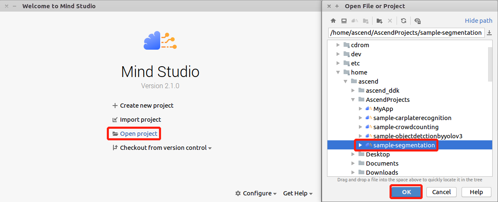
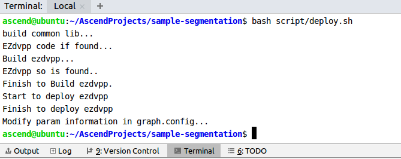
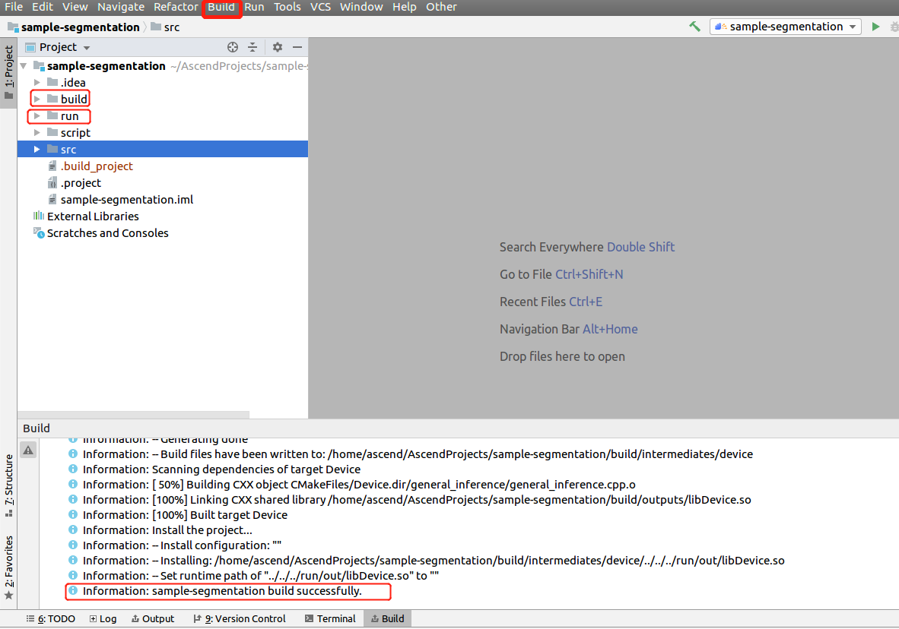
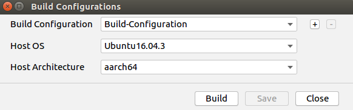

# 语义分割网络应用（C++）<a name="ZH-CN_TOPIC_0219037582"></a>

本Application支持运行在Atlas 200 DK或者AI加速云服务器上，实现了对常见的语义分割网络的推理功能。

当前分支中的应用适配**1.31.0.0及以上**版本的[DDK&RunTime](https://ascend.huawei.com/resources)。

## 前提条件<a name="section137245294533"></a>

部署此Sample前，需要准备好以下环境：

-   已完成Mind Studio的安装。
-   已完成Atlas 200 DK开发者板与Mind Studio的连接，交叉编译器的安装，SD卡的制作及基本信息的配置等。

## 部署<a name="zh-cn_topic_0203223294_section081240125311"></a>

1.  部署，可以选择如下快速部署或者常规方法部署，二选一即可；

    1.1 快速部署，请参考：https://gitee.com/Atlas200DK/faster-deploy 。

    > **说明：**   
    >-   该快速部署脚本可以快速部署多个案例，请选择segmentation案例部署即可。  
    >-   该快速部署脚本自动完成了代码下载、模型转换、环境变量配置等流程，如果需要了解详细的部署过程请选择常规部署方式，请转**1.2 常规部署**。

    1.2 常规部署，请参考：https://gitee.com/Atlas200DK/sample-README/tree/master/sample-segmentation 。

    > **说明：**   
    >-   该部署方式，需要手动完成代码下载、模型转换、环境变量配置等过程。完成后，会对其中的过程会更加了解。

## 编译<a name="section3723145213347"></a>

1.  打开对应的工程。

    以Mind Studio安装用户在命令行中进入安装包解压后的“MindStudio-ubuntu/bin”目录，如：$HOME/MindStudio-ubuntu/bin。执行如下命令启动Mind Studio。

    **./MindStudio.sh**

    启动成功后，打开**sample-segmentation**工程，如[图 打开segmentation工程](#fig9485154817568)所示。

    **图 2**  打开segmentation工程<a name="fig9485154817568"></a>  
    

    

2.  在**src/param\_configure.conf**文件中配置相关工程信息。

    **图 3**  配置文件路径<a name="fig1777213106583"></a>  
    

    

    该配置文件内容如下：

    ```
    remote_host= 
    model_name=
    ```

    需要手动添加参数配置：

    -   remote\_host：Atlas 200 DK开发者板的IP地址。
    -   model\_name : 离线模型名称。

    配置示例：

    ```
    remote_host=192.168.1.2 
    model_name=Fcn8s.om
    ```

    > **说明：**   
    >-   参数必须全部填写，否则无法通过build。  
    >-   注意参数填写时不需要使用“”符号。  
    >-   配置文件中只能填入单个模型名称，默认fcn8s，用户可以在常规部署文档中查询到更多可用模型。  

3. 执行deploy脚本， 进行配置参数调整及第三方库下载编译
    打开Mind Studio工具的Terminal，此时默认在代码主目录下，执行如下命令在后台指执行deploy脚本，进行环境部署。如[图 执行deploy脚本](#zh-cn_topic_0203223294_fig423515251038)所示。
    
    **图 4**  执行deploy脚本<a name="zh-cn_topic_0203223294_fig4235152510387"></a>  
    
    
    
    > **说明：**   
    >-   depoly时，需要选择与开发板通信的主机侧ip，一般为虚拟网卡配置的ip。如果此ip和开发板ip属于同网段，则会自动选择并部署。如果非同网段，则需要手动输入与开发板通信的主机侧ip才能完成deploy。

3.  开始编译，打开Mindstudio工具，在工具栏中点击**Build \> Build \> Build-Configuration**。如[图 编译操作及生成文件](#fig1625447397)所示，会在目录下生成build和run文件夹。

    **图 5**  编译操作及生成文件<a name="fig1487710597597"></a>  
    

    

    注意：

    首次编译工程时，**Build \> Build**为灰色不可点击状态。需要点击**Build \> Edit Build Configuration**，配置编译参数后再进行编译。

    

4.  将需要推理的图片复制到$HOME/AscendProjects/sample-segmentation/run/out 目录。

    fcn模型使用/sample-segmentation/ImageNetRaw文件夹图片测试， erfnet模型使用/sample-segmentation/ImageCity文件夹图片测试。

    图片要求如下：

    -   格式：jpg、png、bmp。
    -   输入图片宽度：16px\~4096px之间的整数。
    -   输入图片高度：16px\~4096px之间的整数。


## 运行<a name="section1620073406"></a>

1.  在Mindstudio工具的工具栏中找到Run按钮，点击  **Run \> Run 'sample-segmentation'**，如[图 程序已执行示意图](#fig18918132273612)所示，可执行程序已经在开发板执行。

    **图 6**  程序已执行示意图<a name="fig18918132273612"></a>  
    

    

    以上报错信息请忽略，因为Mind Studio无法为可执行程序传参，上述步骤是将可执行程序与依赖的库文件部署到开发者板，此步骤需要ssh登录到开发者板至相应的目录文件下手动执行，具体请参考以下步骤。

2.  在Mind Studio所在Ubuntu服务器中，以HwHiAiUser用户SSH登录到Host侧。

    **ssh HwHiAiUser@**_host\_ip_

    对于Atlas 200 DK，host\_ip默认为192.168.1.2（USB连接）或者192.168.0.2（NIC连接）。

3.  进入语义分割网络应用的可执行文件所在路径。

    命令举例如下：

    **cd  /home/HwHiAiUser/HIAI\_PROJECTS/workspace\_mind\_studio//sample-segmentation\_xxxx/out**

4.  执行应用程序。

    执行**run\_segmentation.py**脚本会将推理生成的图片保存至指定路径。

    命令示例如下所示：

    **python3 run\_segmentation.py  -w 500 -h 500 -i  _./example.jpg_ -c 19 **

    -   -w/model\_width：模型的输入图片宽度，为16\~4096之间的整数，请参考[表 通用语义分割网络应用使用模型](#table19942111763710)在Gitee上查看所使用模型文件的Readme，获取模型要求的输入数据的宽和高。
    -   -h/model\_height：模型的输入图片高度，为16\~4096之间的整数，请参考[表 通用语义分割网络应用使用模型](#table19942111763710)在Gitee上查看所使用模型文件的Readme，获取模型要求的输入数据的宽和高。
    -   -i/input\_path：输入图片的路径，可以是目录，表示当前目录下的所有图片都作为输入（可以指定多个输入）。
    -   -o/output\_path： 模型推理结果图片位置。
    -   -c/output\_categories： 模型推理结果类别。

5.  其他详细参数请执行**python3 run\_segmentaion.py --help**命令参见帮助信息。

