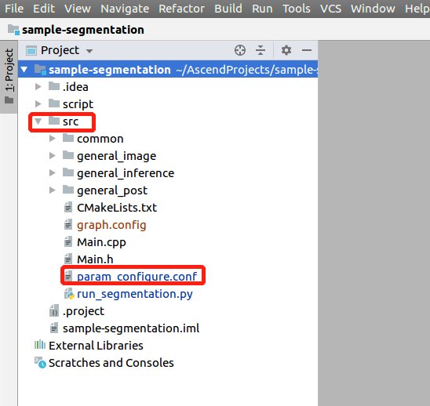

中文|[English](Readme_EN.md)

# 语义分割网络应用（C++）<a name="ZH-CN_TOPIC_0228461807"></a>

本Application支持运行在Atlas 200 DK或者AI加速云服务器上，实现了对常见的语义分割网络的推理功能。

当前分支中的应用适配**1.32.0.0及以上**版本的[DDK&RunTime](https://ascend.huawei.com/resources)。

## 前提条件<a name="section137245294533"></a>

部署此Sample前，需要准备好以下环境：

-   已完成Mind Studio的安装。
-   已完成Atlas 200 DK开发者板与Mind Studio的连接，交叉编译器的安装，SD卡的制作及基本信息的配置等。

## 部署<a name="section412811285117"></a>

可以选择如下快速部署或者常规方法部署，二选一即可：

1.  快速部署，请参考：  [https://gitee.com/Atlas200DK/faster-deploy](https://gitee.com/Atlas200DK/faster-deploy)  。

    > **说明：**   
    >-   该快速部署脚本可以快速部署多个案例，请选择segmentation案例部署即可。  
    >-   该快速部署脚本自动完成了代码下载、模型转换、环境变量配置等流程，如果需要了解详细的部署过程请选择常规部署方式。转: **[2. 常规部署](#li3208251440)**  

2.  <a name="li3208251440"></a>常规部署，请参考：  [https://gitee.com/Atlas200DK/sample-README/tree/master/sample-segmentation](https://gitee.com/Atlas200DK/sample-README/tree/master/sample-segmentation)  。

    > **说明：**   
    >-   该部署方式，需要手动完成代码下载、模型转换、环境变量配置等过程。完成后，会对其中的过程更加了解。  


## 编译<a name="section3723145213347"></a>

1.  打开对应的工程。

    以Mind Studio安装用户在命令行中进入安装包解压后的“MindStudio-ubuntu/bin”目录，如：$HOME/MindStudio-ubuntu/bin。执行如下命令启动Mind Studio。

    **./MindStudio.sh**

    启动成功后，打开**sample-segmentation**工程，如[图 打开segmentation工程](#zh-cn_topic_0219037582_fig9485154817568)所示。

    **图 1**  打开segmentation工程<a name="zh-cn_topic_0219037582_fig9485154817568"></a>  
    

    

2.  在**src/param\_configure.conf**文件中配置相关工程信息。

    **图 2**  配置文件路径<a name="fig1777213106583"></a>  
    

    

    该配置文件内容如下：

    ```
    remote_host= 
    model_name=
    ```

    需要手动添加参数配置：

    -   remote\_host：Atlas 200 DK开发者板的IP地址。
    -   model\_name : 离线模型名称。

    配置示例：

    ```
    remote_host=192.168.1.2 
    model_name=Fcn8s.om
    ```

    > **说明：**   
    >-   参数必须全部填写，否则无法通过build。  
    >-   注意参数填写时不需要使用“”符号。  
    >-   配置文件中只能填入单个模型名称，本示例是以fcn举例，用户可以使用常规部署中列举的其它模型按照文档步骤进行替换运行。  

3.  执行deploy脚本， 进行配置参数调整及第三方库下载编译 打开Mind Studio工具的Terminal，此时默认在代码主目录下，执行如下命令在后台指执行deploy脚本，进行环境部署。如[图 执行deploy脚本](#zh-cn_topic_0219028422_fig4961151613216)所示。

    **图 3**  执行deploy脚本<a name="zh-cn_topic_0219028422_fig4961151613216"></a>  
    

    > **说明：**   
    >-   首次deploy时，没有部署第三方库时会自动下载并编译，耗时可能比较久，请耐心等待。后续再重新编译时，不会重复下载编译，部署如上图所示。  
    >-   deploy时，需要选择与开发板通信的主机侧ip，一般为虚拟网卡配置的ip。如果此ip和开发板ip属于同网段，则会自动选择并部署。如果非同网段，则需要手动输入与开发板通信的主机侧ip才能完成deploy。  

4.  开始编译，打开Mindstudio工具，在工具栏中点击**Build \> Build \> Build-Configuration**。如[图 编译操作及生成文件](#zh-cn_topic_0219037582_fig1487710597597)所示，会在目录下生成build和run文件夹。

    **图 4**  编译操作及生成文件<a name="zh-cn_topic_0219037582_fig1487710597597"></a>  
    

    

    注意：

    首次编译工程时，**Build \> Build**为灰色不可点击状态。需要点击**Build \> Edit Build Configuration**，配置编译参数后再进行编译。

    

5.  将需要推理的图片复制到：$HOME/AscendProjects/sample-segmentation/run/out 目录。

    fcn模型使用/sample-segmentation/ImageNetRaw文件夹下的样例图片进行测试， erfnet模型使用/sample-segmentation/ImageCity文件夹下的样例图片进行测试。

    图片要求如下：

    -   格式：jpg、png、bmp。
    -   输入图片宽度：16px\~4096px之间的整数。
    -   输入图片高度：16px\~4096px之间的整数。


## 运行<a name="section1620073406"></a>

1.  在Mindstudio工具的工具栏中找到Run按钮，点击  **Run \> Run 'sample-segmentation'**，如[图 程序已执行示意图](#fig18918132273612)所示，可执行程序已经在开发板执行。

    **图 5**  程序已执行示意图<a name="fig18918132273612"></a>  
    

    

    以上报错信息请忽略，因为Mind Studio无法为可执行程序传参，上述步骤是将可执行程序与依赖的库文件部署到开发者板，此步骤需要ssh登录到开发者板至相应的目录文件下手动执行，具体请参考以下步骤。

2.  在Mind Studio所在Ubuntu服务器中，以HwHiAiUser用户SSH登录到Host侧。

    **ssh HwHiAiUser@**_host\_ip_

    对于Atlas 200 DK，host\_ip默认为192.168.1.2（USB连接）或者192.168.0.2（NIC连接）。

3.  进入语义分割网络应用的可执行文件所在路径。

    命令举例如下：

    **cd  /home/HwHiAiUser/HIAI\_PROJECTS/workspace\_mind\_studio/sample-segmentation\_xxxx/out**

4.  执行应用程序。

    执行**run\_segmentation.py**脚本会将推理生成的图片保存至指定路径。

    命令示例如下所示：

    **python3 run\_segmentation.py  -w  _500_  -h  _500_  -i** **_./example.jpg -c 19_** 

    -   -w/model\_width：模型的输入图片宽度，为16\~4096之间的整数。
    -   -h/model\_height：模型的输入图片高度，为16\~4096之间的整数。
    -   -i/input\_path：输入图片的路径，可以是目录，表示当前目录下的所有图片都作为输入（可以指定多个输入）。
    -   -o/output\_path： 模型推理结果图片位置。
    -   -c/output\_categories： 模型推理结果每个像素点的类别，fcn模型的类别为21，erfnet的类别为19。

5.  其他详细参数请执行**python3 run\_segmentation.py --help**命令参见帮助信息。

