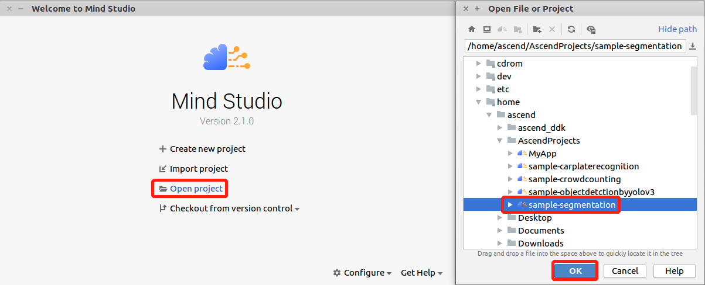
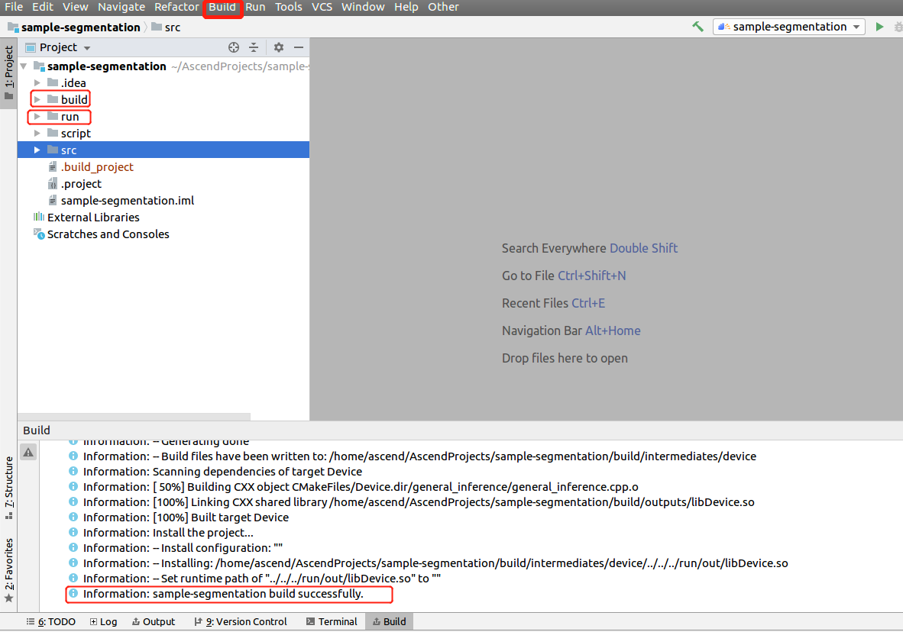
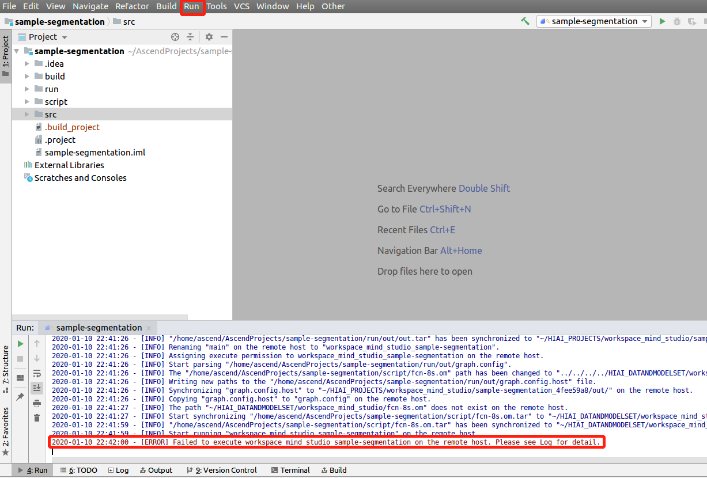

English|[中文](Readme_cn.md)

# Semantic Segmentation Network Application \(C++\)<a name="EN-US_TOPIC_0228461807"></a>

This application runs on the Atlas 200 DK or the AI acceleration cloud server to implement the inference function by using a semantic segmentation network.

The applications in the current version branch adapt to  [DDK&RunTime](https://ascend.huawei.com/resources) **1.32.0.0 and later**.

## Prerequisites<a name="section137245294533"></a>

Before deploying this sample, ensure that:

-   Mind Studio  has been installed.
-   The Atlas 200 DK developer board has been connected to  Mind Studio, the cross compiler has been installed, the SD card has been prepared, and basic information has been configured.

## Deployment<a name="section412811285117"></a>

You can use either of the following methods:

1.  Quick deployment: visit  [https://github.com/Atlas200dk/faster-deploy](https://github.com/Atlas200dk/faster-deploy).

    > **NOTE:**   
    >-   The quick deployment script can be used to deploy multiple samples rapidly. Select  **segmentation**.  
    >-   The quick deployment script automatically completes code download, model conversion, and environment variable configuration. To learn about the detailed deployment process, go to  [2. Common deployment](#li3208251440).  

2.  <a name="li3208251440"></a>Common deployment: visit  [https://github.com/Atlas200dk/sample-README/tree/master/sample-segmentation](https://github.com/Atlas200dk/sample-README/tree/master/sample-segmentation).

    > **NOTE:**   
    >-   In this deployment mode, you need to manually download code, convert models, and configure environment variables.  


## Build<a name="section3723145213347"></a>

1.  Open the project.

    Go to the directory that stores the decompressed installation package as the Mind Studio installation user in CLI mode, for example,  **$HOME/MindStudio-ubuntu/bin**. Run the following command to start Mind Studio:

    **./MindStudio.sh**

    Open the  **sample-segmentation**  project, as shown in  [Figure 1](#en-us_topic_0219037582_fig9485154817568).

    **Figure  1**  Opening the segmentation project<a name="en-us_topic_0219037582_fig9485154817568"></a>  
    

    

2.  Configure project information in the  **src/param\_configure.conf**  file.

    **Figure  2**  Configuration file path<a name="fig1777213106583"></a>  
    

    

    Content of the configuration file:

    ```
    remote_host= 
    model_name=
    ```

    Parameter settings to be manually added:

    -   **remote\_host**: IP address of the Atlas 200 DK developer board
    -   **model\_name**: offline model name

    Configuration example:

    ```
    remote_host=192.168.1.2 
    model_name=Fcn8s.om
    ```

    > **NOTE:**   
    >-   All the parameters must be set. Otherwise, the build fails.  
    >-   Do not use double quotation marks \(""\) during parameter settings.  
    >-   You can type only one model name in the configuration file. The FCN model is used as an example. You can replace it with a model listed in the common deployment by referring to the operation procedure.  

3.  Run the  **deploy.sh**  script to adjust configuration parameters and download and compile the third-party library. Open the  **Terminal**  window of Mind Studio. By default, the home directory of the code is used. Run the  **deploy.sh**  script in the background to deploy the environment, as shown in  [Figure 3](#en-us_topic_0219028422_fig4961151613216).

    **Figure  3**  Running the deploy.sh script<a name="en-us_topic_0219028422_fig4961151613216"></a>  
    

    > **NOTE:**   
    >-   During the first deployment, if no third-party library is used, the system automatically downloads and builds the third-party library, which may take a long time. The third-party library can be directly used for the subsequent build.  
    >-   During deployment, select the IP address of the host that communicates with the developer board. Generally, the IP address is the IP address configured for the virtual NIC. If the IP address is in the same network segment as the IP address of the developer board, it is automatically selected for deployment. If they are not in the same network segment, you need to manually type the IP address of the host that communicates with the Atlas DK to complete the deployment.  

4.  Start the build. Open Mind Studio and choose  **Build \> Build \> Build-Configuration**  from the main menu. The  **build**  and  **run**  folders are generated in the directory, as shown in  [Figure 4](#en-us_topic_0219037582_fig1487710597597).

    **Figure  4**  Build and file generation<a name="en-us_topic_0219037582_fig1487710597597"></a>  
    

    

    Notes:

    When you build a project for the first time,  **Build \> Build**  is unavailable. You need to choose  **Build \> Edit Build Configuration**  to set parameters before the build.

    

5.  Copy the image to be inferred to the  **$HOME/AscendProjects/sample-segmentation/run/out**  directory.

    The FCN model is tested using the sample image in the  **/sample-segmentation/ImageNetRaw**  folder, and the ERFNet model is tested using the sample image in the  **/sample-segmentation/ImageCity**  folder.

    The image requirements are as follows:

    -   Format: jpg, png, and bmp
    -   Width of the input image: an integer ranging from 16px to 4096px
    -   Height of the input image: an integer ranging from 16px to 4096px


## Run<a name="section1620073406"></a>

1.  On the toolbar of Mind Studio, click  **Run**  and choose  **Run \> Run 'sample-segmentation'**. As shown in  [Figure 5](#fig18918132273612), the executable application is running on the developer board.

    **Figure  5**  Running program<a name="fig18918132273612"></a>  
    

    

    You can ignore the error information reported during the execution because Mind Studio cannot transfer parameters for an executable application. In the preceding steps, the executable application and dependent library files are deployed to the developer board. You need to log in to the developer board in SSH mode and manually execute the files in the corresponding directory. For details, see the following steps.

2.  Log in to the host side as the  **HwHiAiUser**  user in SSH mode on Ubuntu Server where  Mind Studio  is located.

    **ssh HwHiAiUser@**_host\_ip_

    For the Atlas 200 DK, the default value of  _**host\_ip**_  is  **192.168.1.2**  \(USB connection mode\) or  **192.168.0.2**  \(NIC connection mode\).

3.  Go to the path of the executable files of the semantic segmentation network application.

    Command example:

    **cd  /home/HwHiAiUser/HIAI\_PROJECTS/workspace\_mind\_studio/sample-segmentation\_xxxx/out**

4.  Run the application.

    Run the  **run\_segmentation.py**  script to save the images which are generated by inference to the specified path.

    Command example:

    **python3 run\_segmentation.py  -w  _500_  -h  _500_  -i** **_./example.jpg -c 19_** 

    -   **-w/model\_width**: width of the input image of a model. The value is an integer ranging from 16 to 4096.
    -   **-h/model\_height**: height of the input image of a model. The value is an integer ranging from 16 to 4096.
    -   **-i/input\_path**: path of the input image. It can be a directory, indicating that all images in the current directory are used as input. \(Multiple inputs can be specified\).
    -   **-o/output\_path**: location of the model inference result image.
    -   **-c/output\_categories**: category of each pixel in the model inference result. The value is  **21**  for the FCN model and  **19**  for the ERFNet model.

5.  For other parameters, run the  **python3 run\_segmentation.py --help**  command. For details, see the help information.

