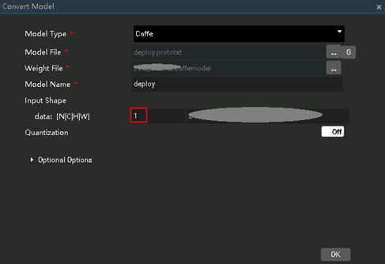

# 语义分割网络应用（C++）

本Application支持运行在Atlas 200 DK或者AI加速云服务器上，实现了对常见的语义分割网络的推理功能并输出前n个推理结果。

当前分支中的应用适配**1.1.1.0**与**1.3.0.0**版本的[DDK&RunTime](https://ascend.huawei.com/resources)。

## 前提条件

部署此Sample前，需要准备好以下环境：

-   已完成Mind Studio的安装。
-   已完成Atlas 200 DK开发者板与Mind Studio的连接，交叉编译器的安装，SD卡的制作及基本信息的配置等。

## 软件准备

运行此Sample前，需要按照此章节获取源码包、准备模型文件并进行相关的环境配置。

1.  获取源码包。

    将[https://gitee.com/Atlas200DK/sample-segmentation](https://gitee.com/Atlas200DK/sample-segmentation)仓中的代码以Mind Studio安装用户下载至Mind Studio所在Ubuntu服务器的任意目录，例如代码存放路径为：$HOME/sample-segmentation。

2.  获取此应用中所需要的原始网络模型。

    参考[表 语义分割网络应用使用模型](#table1119094515272)获取此应用中所用到的原始网络模型及其对应的权重文件，并将其存放到Mind Studio所在Ubuntu服务器的任意目录，例如：$HOME/ascend/models/erfnet。

    **表 1**  语义分割网络应用使用模型

    
    <table><thead align="left"><tr id="row677354502719"><th class="cellrowborder" valign="top" width="16.259999999999998%" id="mcps1.2.4.1.1">
模型名称

    </th>
    <th class="cellrowborder" valign="top" width="17.51%" id="mcps1.2.4.1.2">
模型说明

    </th>
    <th class="cellrowborder" valign="top" width="66.23%" id="mcps1.2.4.1.3">
模型下载路径

    </th>
    </tr>
    </thead>
    <tbody><tr id="row17513194404914"><td class="cellrowborder" valign="top" width="16.259999999999998%" headers="mcps1.2.4.1.1 ">
erfnet

    </td>
    <td class="cellrowborder" valign="top" width="17.51%" headers="mcps1.2.4.1.2 ">
图片语义分割推理模型。

    
此模型为此应用中使用的模型。

    
是基于Caffe的erfnet模型。

    </td>
    <td class="cellrowborder" valign="top" width="66.23%" headers="mcps1.2.4.1.3 ">
请参考<a href="https://github.com/Ascend/models/tree/master/computer_vision/segmentation/erfnet" target="_blank" rel="noopener noreferrer">https://github.com/Ascend/models/tree/master/computer_vision/segmentation/erfnet</a>目录中README.md下载原始网络模型文件及其对应的权重文件。

    </td>
    </tr>
    <tr id="row17757454270"><td class="cellrowborder" valign="top" width="16.259999999999998%" headers="mcps1.2.4.1.1 ">
Fcn8s

    </td>
    <td class="cellrowborder" valign="top" width="17.51%" headers="mcps1.2.4.1.2 ">
图片语义分割推理模型。

    
此模型为此应用中使用的模型。

    
是基于Caffe的fcn模型。

    </td>
    <td class="cellrowborder" valign="top" width="66.23%" headers="mcps1.2.4.1.3 ">
请参考<a href="https://github.com/Ascend/models/tree/master/computer_vision/segmentation/fcn8s" target="_blank" rel="noopener noreferrer">https://github.com/Ascend/models/tree/master/computer_vision/segmentation/fcn8s</a>目录中README.md下载原始网络模型文件及其对应的权重文件。

    </td>
    </tr>
    </tbody>
    </table>

3.  将原始网络模型转换为适配昇腾AI处理器的模型。
    1.  在Mind Studio操作界面的顶部菜单栏中选择“Tool \> Convert Model”，进入模型转换界面。
    2.  在弹出的**Convert Model**操作界面中，Model File与Weight File分别选择[2](#li29641938112018)中下载的模型文件和权重文件。
        -   **Model Name**填写为[表1](#table1119094515272)中对应的**模型名称**。
        -   Fcn8s、erfnet模型中网络贯通应用一次处理一张图片，所以转换时需要将Input Shape的N修改为1

            **图 1**  Input Shape配置示例  
            

    3.  单击OK开始转换模型。

        模型转换成功后，后缀为.om的离线模型存放地址为：$HOME/tools/che/model-zoo/my-model/xxx。

4.  以Mind Studio安装用户登录Mind Studio所在Ubuntu服务器，并设置环境变量DDK\_HOME。

    **vim \~/.bashrc**

    执行如下命令在最后一行添加DDK\_HOME及LD\_LIBRARY\_PATH的环境变量。

    **export DDK\_HOME=$HOME/tools/che/ddk/ddk**

    **export LD\_LIBRARY\_PATH=$DDK\_HOME/uihost/lib**

    > **说明：**   
    >-   如果此环境变量已经添加，则此步骤可跳过。  

    输入:wq!保存退出。

    执行如下命令使环境变量生效。

    **source \~/.bashrc**

## 部署

1.  以Mind Studio安装用户进入通用分类网络应用代码所在根目录，如：$HOME/sample-segmentation。
2.  执行部署脚本，进行工程环境准备，包括公共库的编译与部署、应用的编译与部署等操作。

    **bash deploy.sh  _host\_ip_ _model\_mode_**

    -   _host\_ip_：对于Atlas 200 DK开发者板，即为开发者板的IP地址。对于AI加速云服务器，即为Host的IP地址。
    -   _model\_mode_  代表模型文件的部署方式，默认为internet。
        -   **local**：若Mind Studio所在Ubuntu系统未连接网络，请使用local模式，执行此命令前，需要参考[依赖代码库下载](#section92241245122511)将依赖的公共代码库ezdvpp下载到“sample-classification/script“目录下。
        -   **internet**：若Mind Studio所在Ubuntu系统已连接网络，请使用internet模式，在线下载依赖代码库ezdvpp。

    命令示例：

    **bash deploy.sh 192.168.1.2 internet**

3.  将环境准备时转换好的需要使用的离线模型文件与需要推理的图片上传至Host侧任一属组为HwHiAiUser用户的目录。

    例如将模型文件**erfnet.om**上传到Host侧的“/home/HwHiAiUser/models“目录下。

    图片要求如下：

    -   格式：jpg、png、bmp。
    -   输入图片宽度：16px\~4096px之间的整数。
    -   输入图片高度：16px\~4096px之间的整数。

## 运行

1.  在Mind Studio所在Ubuntu服务器中，以HwHiAiUser用户SSH登录到Host侧。

    **ssh HwHiAiUser@**_host\_ip_

    对于Atlas 200 DK，host\_ip默认为192.168.1.2（USB连接）或者192.168.0.2（NIC连接）。

    对于AI加速云服务器，host\_ip即为当前Mind Studio所在服务器的IP地址。

2.  进入语义分割网络应用的可执行文件所在路径。

    **cd \~/HIAI\_PROJECTS/ascend\_workspace/segmentation/out**

3.  执行应用程序。

    执行**run\_segmentation.py**脚本会将推理结果在执行终端直接打印显示。

    命令示例如下所示：

    python3 run\_segmentation.py  -m \~/models/erfnet.om -w 1024  -h 512  -i ./example.jpg -n 10

    -   -m/--model\_path：离线模型存储路径。
    -   -w/model\_width：模型的输入图片宽度，为16\~4096之间的整数，请参考[表1](#table1119094515272)查看所使用模型文件的Readme，获取模型要求的输入数据的宽和高。
    -   -h/model\_height：模型的输入图片高度，为16\~4096之间的整数，请参考[表1](#table1119094515272)查看所使用模型文件的Readme，获取模型要求的输入数据的宽和高。
    -   -i/input\_path：输入图片的路径，可以是目录，表示当前目录下的所有图片都作为输入（可以指定多个输入）。
    -   -n/top\_n：输出前n个推理结果。

    其他详细参数请执行**python3 run\_segmentation.py --help**命令参见帮助信息。

## 依赖代码库下载

将依赖的软件库下载到"sample-segmentation/script"目录下。

**表 2**  依赖代码库下载

<table><thead align="left"><tr id="row1335913343368"><th class="cellrowborder" valign="top" width="33.33333333333333%" id="mcps1.2.4.1.1">
模块名称

</th>
<th class="cellrowborder" valign="top" width="33.33333333333333%" id="mcps1.2.4.1.2">
模块描述

</th>
<th class="cellrowborder" valign="top" width="33.33333333333333%" id="mcps1.2.4.1.3">
下载地址

</th>
</tr>
</thead>
<tbody><tr id="row436033423616"><td class="cellrowborder" valign="top" width="33.33333333333333%" headers="mcps1.2.4.1.1 ">
EZDVPP

</td>
<td class="cellrowborder" valign="top" width="33.33333333333333%" headers="mcps1.2.4.1.2 ">
对DVPP接口进行了封装，提供对图片/视频的处理能力。

</td>
<td class="cellrowborder" valign="top" width="33.33333333333333%" headers="mcps1.2.4.1.3 ">
<a href="https://gitee.com/Atlas200DK/sdk-ezdvpp" target="_blank" rel="noopener noreferrer">https://gitee.com/Atlas200DK/sdk-ezdvpp</a>

下载后请保持文件夹名称为ezdvpp。

</td>
</tr>
</tbody>
</table>

